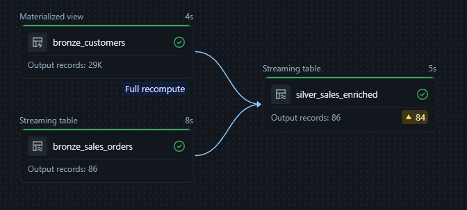
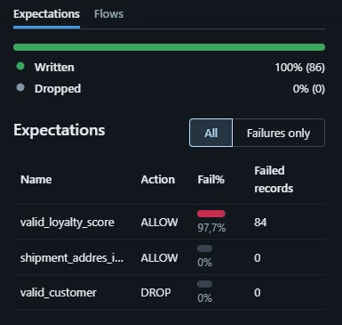

# Lab 5 — Declarative Pipelines / Lakeflow

## 1. Code Overview: Declarative Pipeline Architecture

The pipeline follows the Medallion Architecture (Bronze -> Silver), utilizing the new Lakeflow API. I used mockup data straight from databricks. Unfortunatelly it turned out to be quite incomplete and did not carry much info but it was good enough to practice this new approach.

1.`declarative_streaming.ipynb` (Bronze Layer - Stream)
This notebook reads streaming data using Databricks Auto Loader.
*   **Decorator:** `@pipelines.table` registers the output as a declarative streaming target.

2.`declarative_csv.ipynb` (Bronze Layer - Static)
This notebook loads static reference data from CSV files.
*   **Decorator:** `@pipelines.materialized_view` is used because this is batch/static reference data, not a continuous stream.

3.`declarative_silver.py` (Silver Layer & Expectations)
This notebook enriches the streaming sales data with the static customer data and applies Data Quality rules. 
*   Stream-Static Join: left join of tables from both sources
*   Expectations: I applied some test expectations to see how it works
    *   `@pipelines.expect_or_drop(...)`: Drops any record that doesnt meet the expectation.
    *   `@pipelines.expect(...)`: Monitors and reports records that doesnt meet the expectation. Serves as a good way to check the data quality

---

## 2. Analyzing Data Lineage

Databricks Lakeflow automatically infers the dependencies between datasets and generates a visual graph in the UI. The silver layer notebook reads data from bronze layer which is automatically detected by the pipeline and connects to Bronze nodes to the Silver node.

Data Quality UI: Now we can review our data quality checks that we set up with expectations in code. As shown in the screenshot my quality check proves that this data has a very poor quality. Pretty much all of the recorded sales does not have a matching customer in the customers database.

---

## 3. Declarative Pipelines vs. Classic Spark Pipelines

| Feature | Declarative Pipelines (Lakeflow / DLT) | Classic Spark Jobs (Structured Streaming) |
| :--- | :--- | :--- |
| **Paradigm** | (Declarative). You define targets and Databricks handles execution. | (Imperative). You write explicit execution logic. You have to cover for everything.
| **Checkpoints** | Managed automatically. No path definitions required. | Requires specified paths `.option("checkpointLocation", path)`. |
| **Lineage & Orchestration** | Automatic graph and lineage generation. Dependencies are resolved natively. | Manual task orchestration. Configuring jobs and workflow step-by-step. |
| **Data Quality** | Expectations set on data automatically revise data and report in UI. | Requires writing manual filters, constraints and reporting techniques. |

### Operational Simplicity vs. Flexibility
*   **Simplicity:** Lakeflow massively reduces boilerplate code. You can spend time writing business logic rather than managing infrastructure, retries, and checkpoint paths.
*   **Flexibility:** Classic Spark offers maximum flexibility. If you need to work in a non standard way or if you require low-level tuning of Spark, classic Spark is required. Declarative pipelines strictly manage the data within the Databricks Delta ecosystem.

### Cost Considerations
From the informations I gathered the raw compute of LDP might be slightly more expensive but the overall cost is usually lower because it drastically reduces required Data Engineering maintenance hours, eliminates cluster idle time through intelligent auto-scaling, and optimizes cluster lifecycles automatically. 